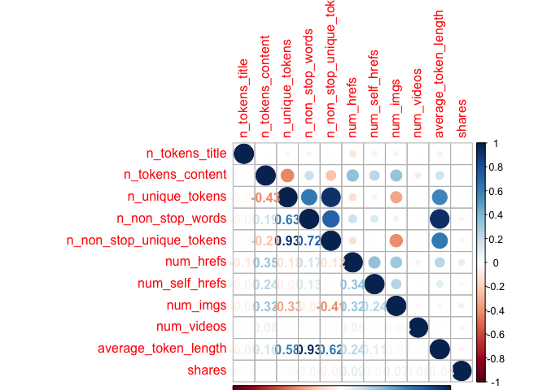
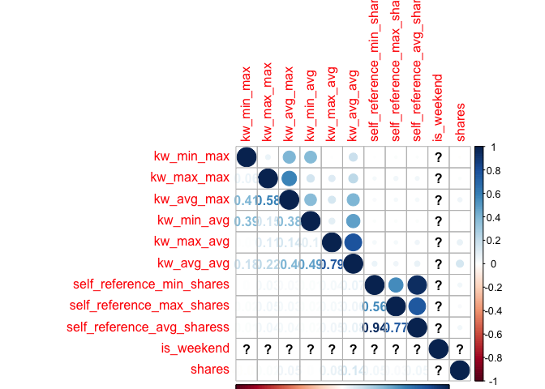
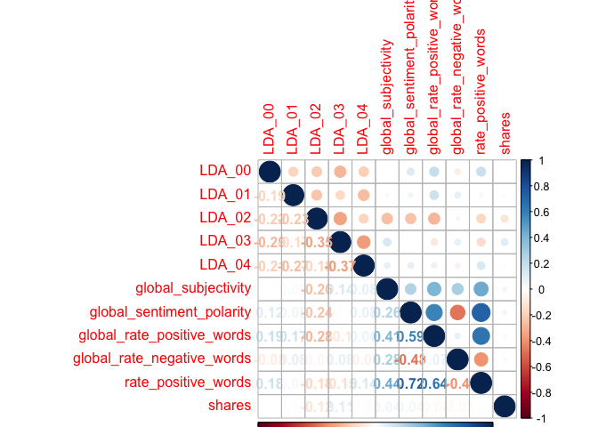
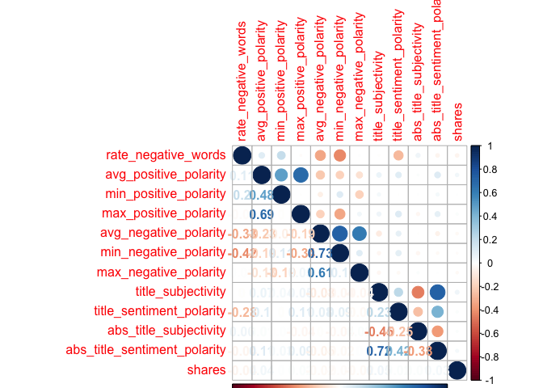

ST558\_PROJECT2
================
Qiaozhi Bao
2020/10/6

# Introduction

## Describe the data

The [Online News Popularity data
set](%22https://archive.ics.uci.edu/ml/datasets/Online+News+Popularity%22)
was published two years ago to summarize a heterogeneous set of features
about articles published by Mashable in a period of two years. There are
61 variables in total from the data set above: 58 predictive attributes,
2 non-predictive and 1 goal field.More details and summarization will be
discussed later in this project.

## The purpose of Analysis

The purpose of this analysis is to create two models(ensemble and not
ensemble) to generate the best predict of the response
attribute–shares.Our analysis will help to determine what kind of
content would be most popular.

## Methods

For this project,I first split the data into training set and test
set,then I examine the data with summary statistics and correlation
plots to see the relationships between predictive attributes and the
relationship between predictive attributes and response variables,then
some meaningless variables were moved. I then utilized the caret package
to create two models.Tree-based model chosen using leave one out cross
validation.Boosted tree model chosen using cross-validation.

# Data Study

## Description of the Used Data

As our study intention is to predict the popularity of an article, so we
choose the shares as the response variable.After plotting the
correlations between variables, we removed some high related predictive
variables. The two models were fitted by remaining variables in the
training set.

``` r
# Load all libraries
library(tidyverse)
library(ggplot2)
library(randomForest)
library(caret)
library(tree)
library(gbm)
library(corrplot)
library(e1071)
set.seed(1)
```

``` r
# Read in data and removing the first two columns as they are not predictive variables.
news_pop <- read_csv('./OnlineNewsPopularity.csv') %>% select(-`url`,-`timedelta`)
```

    ## Parsed with column specification:
    ## cols(
    ##   .default = col_double(),
    ##   url = col_character()
    ## )

    ## See spec(...) for full column specifications.

``` r
params$weekday
```

    ## [1] "weekday_is_sunday"

``` r
# First to see Monday data
data <- news_pop%>% select(!starts_with('weekday_is'),params$weekday)
# Check if we have missing values, answer is 'No'
sum(is.na(data))
```

    ## [1] 0

``` r
data <-data %>% filter(data[,53]==1) %>%select(-params$weekday)
```

As there is no missing value in our Monday data, we will step to split
data. By using sample(), with 70% of the data goes to the training set
(4,662 observations, Mon\_train) and 30% goes to the test set (1,999
observations, Mon\_test).

``` r
# Split Monday data,70% for training set and 30% for test set
set.seed(1)
train <- sample(1:nrow(data),size = nrow(data)*0.7)
test <- dplyr::setdiff(1:nrow(data),train)
train_data <-data[train,]
test_data <- data[test,]
```

# Data Summarizations

## Predictor Variables

I used the `summary()` function to calculate summary statistics for each
of the quantitative variables in data.I divided the data into trunks to
make plots easier to compare.

``` r
summary(train_data)
```

    ##  n_tokens_title  n_tokens_content n_unique_tokens  n_non_stop_words
    ##  Min.   : 3.00   Min.   :   0.0   Min.   :0.0000   Min.   :0.0000  
    ##  1st Qu.: 9.00   1st Qu.: 245.0   1st Qu.:0.4618   1st Qu.:1.0000  
    ##  Median :10.00   Median : 454.0   Median :0.5275   Median :1.0000  
    ##  Mean   :10.52   Mean   : 593.5   Mean   :0.5268   Mean   :0.9713  
    ##  3rd Qu.:12.00   3rd Qu.: 794.5   3rd Qu.:0.6073   3rd Qu.:1.0000  
    ##  Max.   :19.00   Max.   :8474.0   Max.   :0.9796   Max.   :1.0000  
    ##  n_non_stop_unique_tokens   num_hrefs      num_self_hrefs      num_imgs      
    ##  Min.   :0.0000           Min.   :  0.00   Min.   : 0.000   Min.   :  0.000  
    ##  1st Qu.:0.6128           1st Qu.:  5.00   1st Qu.: 1.000   1st Qu.:  1.000  
    ##  Median :0.6794           Median :  9.00   Median : 2.000   Median :  1.000  
    ##  Mean   :0.6649           Mean   : 12.52   Mean   : 3.556   Mean   :  5.897  
    ##  3rd Qu.:0.7524           3rd Qu.: 16.00   3rd Qu.: 4.000   3rd Qu.:  9.000  
    ##  Max.   :1.0000           Max.   :153.00   Max.   :39.000   Max.   :111.000  
    ##    num_videos      average_token_length  num_keywords    data_channel_is_lifestyle
    ##  Min.   : 0.0000   Min.   :0.000        Min.   : 1.000   Min.   :0.0000           
    ##  1st Qu.: 0.0000   1st Qu.:4.486        1st Qu.: 6.000   1st Qu.:0.0000           
    ##  Median : 0.0000   Median :4.683        Median : 8.000   Median :0.0000           
    ##  Mean   : 0.9843   Mean   :4.577        Mean   : 7.669   Mean   :0.0799           
    ##  3rd Qu.: 1.0000   3rd Qu.:4.873        3rd Qu.: 9.000   3rd Qu.:0.0000           
    ##  Max.   :73.0000   Max.   :5.994        Max.   :10.000   Max.   :1.0000           
    ##  data_channel_is_entertainment data_channel_is_bus data_channel_is_socmed
    ##  Min.   :0.0000                Min.   :0.0000      Min.   :0.00000       
    ##  1st Qu.:0.0000                1st Qu.:0.0000      1st Qu.:0.00000       
    ##  Median :0.0000                Median :0.0000      Median :0.00000       
    ##  Mean   :0.1906                Mean   :0.1243      Mean   :0.04648       
    ##  3rd Qu.:0.0000                3rd Qu.:0.0000      3rd Qu.:0.00000       
    ##  Max.   :1.0000                Max.   :1.0000      Max.   :1.00000       
    ##  data_channel_is_tech data_channel_is_world   kw_min_min       kw_max_min   
    ##  Min.   :0.0000       Min.   :0.0000        Min.   : -1.00   Min.   :    0  
    ##  1st Qu.:0.0000       1st Qu.:0.0000        1st Qu.: -1.00   1st Qu.:  484  
    ##  Median :0.0000       Median :0.0000        Median : -1.00   Median :  694  
    ##  Mean   :0.1457       Mean   :0.2057        Mean   : 29.59   Mean   : 1114  
    ##  3rd Qu.:0.0000       3rd Qu.:0.0000        3rd Qu.:  4.00   3rd Qu.: 1100  
    ##  Max.   :1.0000       Max.   :1.0000        Max.   :217.00   Max.   :81200  
    ##    kw_avg_min        kw_min_max       kw_max_max       kw_avg_max       kw_min_avg  
    ##  Min.   :   -1.0   Min.   :     0   Min.   : 37400   Min.   :  7328   Min.   :   0  
    ##  1st Qu.:  158.9   1st Qu.:     0   1st Qu.:843300   1st Qu.:168580   1st Qu.:   0  
    ##  Median :  243.8   Median :  1800   Median :843300   Median :231000   Median :1171  
    ##  Mean   :  320.3   Mean   : 12406   Mean   :748983   Mean   :242959   Mean   :1219  
    ##  3rd Qu.:  376.3   3rd Qu.:  8900   3rd Qu.:843300   3rd Qu.:307667   3rd Qu.:2169  
    ##  Max.   :27123.0   Max.   :690400   Max.   :843300   Max.   :762840   Max.   :3585  
    ##    kw_max_avg       kw_avg_avg      self_reference_min_shares self_reference_max_shares
    ##  Min.   :  2536   Min.   :  743.5   Min.   :     0            Min.   :     0           
    ##  1st Qu.:  3623   1st Qu.: 2497.0   1st Qu.:   674            1st Qu.:  1000           
    ##  Median :  4816   Median : 3040.8   Median :  1300            Median :  2700           
    ##  Mean   :  6060   Mean   : 3306.3   Mean   :  4199            Mean   : 10352           
    ##  3rd Qu.:  6864   3rd Qu.: 3855.7   3rd Qu.:  2700            3rd Qu.:  7600           
    ##  Max.   :120100   Max.   :15336.1   Max.   :843300            Max.   :843300           
    ##  self_reference_avg_sharess   is_weekend     LDA_00            LDA_01       
    ##  Min.   :     0.0           Min.   :1    Min.   :0.01824   Min.   :0.01820  
    ##  1st Qu.:   984.5           1st Qu.:1    1st Qu.:0.02500   1st Qu.:0.02500  
    ##  Median :  2150.8           Median :1    Median :0.03333   Median :0.03334  
    ##  Mean   :  6125.8           Mean   :1    Mean   :0.16610   Mean   :0.15677  
    ##  3rd Qu.:  5000.0           3rd Qu.:1    3rd Qu.:0.19850   3rd Qu.:0.17435  
    ##  Max.   :843300.0           Max.   :1    Max.   :0.92000   Max.   :0.92595  
    ##      LDA_02            LDA_03            LDA_04        global_subjectivity
    ##  Min.   :0.01818   Min.   :0.01818   Min.   :0.01945   Min.   :0.0000     
    ##  1st Qu.:0.02500   1st Qu.:0.02523   1st Qu.:0.02530   1st Qu.:0.3974     
    ##  Median :0.03334   Median :0.05000   Median :0.04000   Median :0.4604     
    ##  Mean   :0.19628   Mean   :0.26628   Mean   :0.21456   Mean   :0.4490     
    ##  3rd Qu.:0.27968   3rd Qu.:0.50891   3rd Qu.:0.32739   3rd Qu.:0.5148     
    ##  Max.   :0.92000   Max.   :0.91997   Max.   :0.92644   Max.   :0.9125     
    ##  global_sentiment_polarity global_rate_positive_words global_rate_negative_words
    ##  Min.   :-0.37393          Min.   :0.00000            Min.   :0.00000           
    ##  1st Qu.: 0.05948          1st Qu.:0.02817            1st Qu.:0.01004           
    ##  Median : 0.12061          Median :0.03951            Median :0.01615           
    ##  Mean   : 0.12294          Mean   :0.04099            Mean   :0.01706           
    ##  3rd Qu.: 0.18531          3rd Qu.:0.05283            3rd Qu.:0.02238           
    ##  Max.   : 0.63175          Max.   :0.13542            Max.   :0.10112           
    ##  rate_positive_words rate_negative_words avg_positive_polarity min_positive_polarity
    ##  Min.   :0.0000      Min.   :0.0000      Min.   :0.0000        Min.   :0.0000       
    ##  1st Qu.:0.6000      1st Qu.:0.1875      1st Qu.:0.3098        1st Qu.:0.0500       
    ##  Median :0.7059      Median :0.2857      Median :0.3667        Median :0.1000       
    ##  Mean   :0.6788      Mean   :0.2925      Mean   :0.3636        Mean   :0.0988       
    ##  3rd Qu.:0.8000      3rd Qu.:0.3846      3rd Qu.:0.4250        3rd Qu.:0.1000       
    ##  Max.   :1.0000      Max.   :1.0000      Max.   :1.0000        Max.   :1.0000       
    ##  max_positive_polarity avg_negative_polarity min_negative_polarity max_negative_polarity
    ##  Min.   :0.000         Min.   :-1.0000       Min.   :-1.0000       Min.   :-1.0000      
    ##  1st Qu.:0.600         1st Qu.:-0.3341       1st Qu.:-0.7071       1st Qu.:-0.1250      
    ##  Median :0.800         Median :-0.2615       Median :-0.5000       Median :-0.1000      
    ##  Mean   :0.777         Mean   :-0.2691       Mean   :-0.5405       Mean   :-0.1103      
    ##  3rd Qu.:1.000         3rd Qu.:-0.1984       3rd Qu.:-0.3333       3rd Qu.:-0.0500      
    ##  Max.   :1.000         Max.   : 0.0000       Max.   : 0.0000       Max.   : 0.0000      
    ##  title_subjectivity title_sentiment_polarity abs_title_subjectivity
    ##  Min.   :0.0000     Min.   :-1.0000          Min.   :0.0000        
    ##  1st Qu.:0.0000     1st Qu.: 0.0000          1st Qu.:0.1333        
    ##  Median :0.2667     Median : 0.0000          Median :0.4000        
    ##  Mean   :0.3163     Mean   : 0.0888          Mean   :0.3218        
    ##  3rd Qu.:0.5000     3rd Qu.: 0.2500          3rd Qu.:0.5000        
    ##  Max.   :1.0000     Max.   : 1.0000          Max.   :0.5000        
    ##  abs_title_sentiment_polarity     shares     
    ##  Min.   :0.0000               Min.   :  171  
    ##  1st Qu.:0.0000               1st Qu.: 1300  
    ##  Median :0.1000               Median : 1900  
    ##  Mean   :0.1857               Mean   : 3876  
    ##  3rd Qu.:0.3000               3rd Qu.: 3700  
    ##  Max.   :1.0000               Max.   :82000

``` r
correlation1 <- cor(train_data[,c(1:10,52)])
corrplot(correlation1,type='upper',tl.pos = 'lt')
corrplot(correlation1,type='lower',method = 'number',add = T,diag = F,tl.pos = 'n')
```

<!-- -->

``` r
correlation2 <- cor(train_data[,c(11:20,52)])
corrplot(correlation2,type='upper',tl.pos = 'lt')
corrplot(correlation2,type='lower',method = 'number',add = T,diag = F,tl.pos = 'n')
```

<!-- -->

``` r
correlation3 <- cor(train_data[,c(21:30,52)])
```

    ## Warning in cor(train_data[, c(21:30, 52)]): the standard deviation is zero

``` r
corrplot(correlation3,type='upper',tl.pos = 'lt')
corrplot(correlation3,type='lower',method = 'number',add = T,diag = F,tl.pos = 'n')
```

<!-- -->

``` r
correlation4 <- cor(train_data[,c(31:40,52)])
corrplot(correlation4,type='upper',tl.pos = 'lt')
corrplot(correlation4,type='lower',method = 'number',add = T,diag = F,tl.pos = 'n')
```

<!-- -->

``` r
correlation5 <- cor(train_data[,c(41:51,52)])
corrplot(correlation5,type='upper',tl.pos = 'lt')
corrplot(correlation5,type='lower',method = 'number',add = T,diag = F,tl.pos = 'n')
```

<!-- -->

Unfortunately I did not find any variables are strongly related with the
response,so my plan is remove some highly correlated predictive
variables. From the correlation plot,I decided to remove some
meaningless variables:`is_weekend`,variables start with “LDA”. Also some
highly correlated variables will be removed too,like variables start
with“kw”,then we will get a new train set and test set.

``` r
#Remove meaningless variables
train_data <- train_data %>% select(!starts_with("LDA"),-is_weekend)
test_data <- test_data %>% select(!starts_with("LDA"),-is_weekend)
train_data <- train_data %>% select(!starts_with('kw'))
test_data <- train_data %>% select(!starts_with('kw'))
```

# First Model

## Tree based model chosen using leave one out cross validation

``` r
tree.method <- train(shares ~.,data = train_data,method='rpart',
                       preProcess = c("center","scale"),
                     trControl = trainControl(method ='LOOCV'))
tree.method$results
tree.method$bestTune
```

# Second Model

## Boosted tree model chosen using cross-validation

``` r
# We will fit the model using repeated CV
boosted.method <- train(shares ~.,data = train_data,method = 'gbm',
                      trControl = trainControl(method = 'repeatedcv', number=5,repeats =2),
                      preProcess = c("center","scale"),
                      verbose = FALSE)

boosted.method$results
boosted.method$bestTune
```

## Compare RMSE

We will make predictions using beset model fits and test set to compare
the RMSE of the two models.We will choose the model with a smaller RMSE
as our optimal model.

``` r
# predict values on test set and compare RMSE for two models
pred.tree <- predict(tree.method,test_data)
pred.boost <- predict(boosted.method,test_data)
compare <- rbind(postResample(pred.tree,test_data$shares),postResample(pred.boost,test_data$shares))
rownames(compare)<-c("Tree method","Boosted method")
compare
```

    ##                    RMSE   Rsquared      MAE
    ## Tree method    6490.786 0.01878426 3159.848
    ## Boosted method 6326.148 0.07239851 3111.680

We generate two very similar RMSE,the smaller is preferred. In this
case,we can see the boosted method generates smaller RMSE which is the
same as we expected.The boosted method tend to have a better prediction
than the tree based method.
