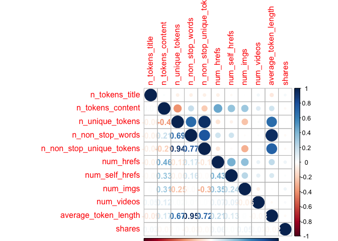
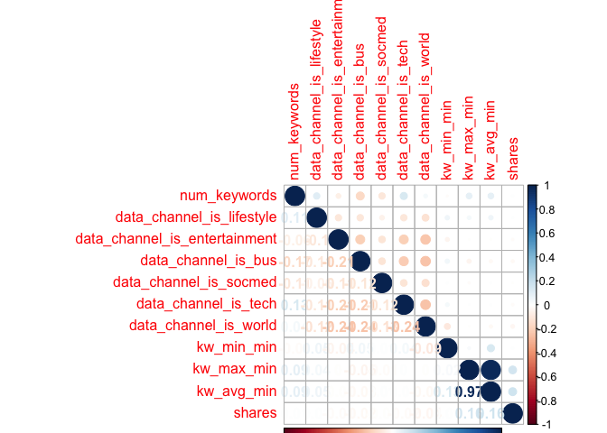
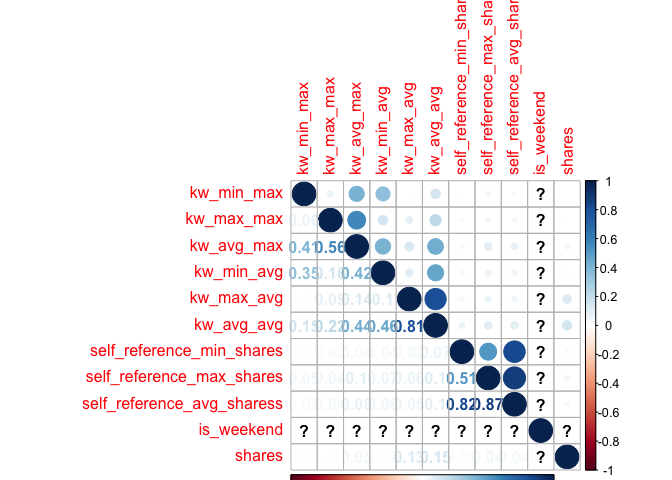
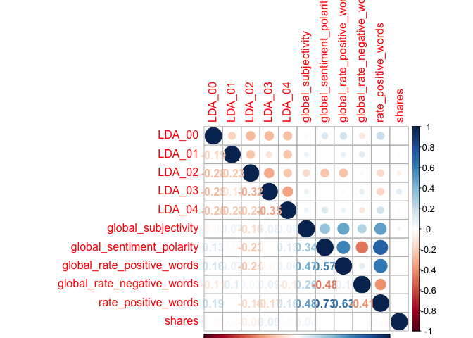
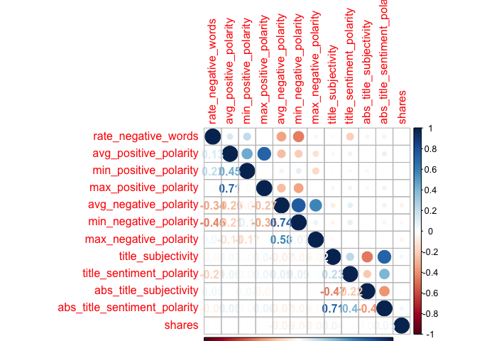

ST558\_PROJECT2
================
Qiaozhi Bao
2020/10/6

# Introduction

## Describe the data

The [Online News Popularity data
set](%22https://archive.ics.uci.edu/ml/datasets/Online+News+Popularity%22)
was published two years ago to summarize a heterogeneous set of features
about articles published by Mashable in a period of two years. There are
61 variables in total from the data set above: 58 predictive attributes,
2 non-predictive and 1 goal field.More details and summarization will be
discussed later in this project.

## The purpose of Analysis

The purpose of this analysis is to create two models(ensemble and not
ensemble) to generate the best predict of the response
attribute–shares.Our analysis will help to determine what kind of
content would be most popular.

## Methods

For this project,I first split the data into training set and test
set,then I examine the data with summary statistics and correlation
plots to see the relationships between predictive attributes and the
relationship between predictive attributes and response variables,then
some meaningless variables were moved. I then utilized the caret package
to create two models.Tree-based model chosen using leave one out cross
validation.Boosted tree model chosen using cross-validation.

# Data Study

## Description of the Used Data

As our study intention is to predict the popularity of an article, so we
choose the shares as the response variable.After plotting the
correlations between variables, we removed some high related predictive
variables. The two models were fitted by remaining variables in the
training set.

``` r
# Load all libraries
library(tidyverse)
library(ggplot2)
library(randomForest)
library(caret)
library(tree)
library(gbm)
library(corrplot)
library(e1071)
set.seed(1)
```

``` r
# Read in data and removing the first two columns as they are not predictive variables.
news_pop <- read_csv('./OnlineNewsPopularity.csv') %>% select(-`url`,-`timedelta`)
```

    ## Parsed with column specification:
    ## cols(
    ##   .default = col_double(),
    ##   url = col_character()
    ## )

    ## See spec(...) for full column specifications.

``` r
params$weekday
```

    ## [1] "weekday_is_thursday"

``` r
# First to see Monday data
data <- news_pop%>% select(!starts_with('weekday_is'),params$weekday)
# Check if we have missing values, answer is 'No'
sum(is.na(data))
```

    ## [1] 0

``` r
data <-data %>% filter(data[,53]==1) %>%select(-params$weekday)
```

As there is no missing value in our Monday data, we will step to split
data. By using sample(), with 70% of the data goes to the training set
(4,662 observations, Mon\_train) and 30% goes to the test set (1,999
observations, Mon\_test).

``` r
# Split Monday data,70% for training set and 30% for test set
set.seed(1)
train <- sample(1:nrow(data),size = nrow(data)*0.7)
test <- dplyr::setdiff(1:nrow(data),train)
train_data <-data[train,]
test_data <- data[test,]
```

# Data Summarizations

## Predictor Variables

I used the `summary()` function to calculate summary statistics for each
of the quantitative variables in data.I divided the data into trunks to
make plots easier to compare.

``` r
summary(train_data)
```

    ##  n_tokens_title  n_tokens_content n_unique_tokens  n_non_stop_words
    ##  Min.   : 3.00   Min.   :   0.0   Min.   :0.0000   Min.   :0.0000  
    ##  1st Qu.: 9.00   1st Qu.: 245.0   1st Qu.:0.4720   1st Qu.:1.0000  
    ##  Median :10.00   Median : 398.5   Median :0.5408   Median :1.0000  
    ##  Mean   :10.33   Mean   : 538.8   Mean   :0.5314   Mean   :0.9699  
    ##  3rd Qu.:12.00   3rd Qu.: 697.8   3rd Qu.:0.6093   3rd Qu.:1.0000  
    ##  Max.   :18.00   Max.   :4585.0   Max.   :0.9545   Max.   :1.0000  
    ##  n_non_stop_unique_tokens   num_hrefs      num_self_hrefs      num_imgs      
    ##  Min.   :0.0000           Min.   :  0.00   Min.   : 0.000   Min.   :  0.000  
    ##  1st Qu.:0.6260           1st Qu.:  4.00   1st Qu.: 1.000   1st Qu.:  1.000  
    ##  Median :0.6923           Median :  7.00   Median : 2.000   Median :  1.000  
    ##  Mean   :0.6737           Mean   : 10.56   Mean   : 3.131   Mean   :  4.413  
    ##  3rd Qu.:0.7556           3rd Qu.: 13.00   3rd Qu.: 4.000   3rd Qu.:  3.000  
    ##  Max.   :1.0000           Max.   :140.00   Max.   :56.000   Max.   :100.000  
    ##    num_videos    average_token_length  num_keywords    data_channel_is_lifestyle
    ##  Min.   : 0.00   Min.   :0.000        Min.   : 1.000   Min.   :0.00000          
    ##  1st Qu.: 0.00   1st Qu.:4.483        1st Qu.: 6.000   1st Qu.:0.00000          
    ##  Median : 0.00   Median :4.674        Median : 7.000   Median :0.00000          
    ##  Mean   : 1.25   Mean   :4.550        Mean   : 7.156   Mean   :0.05112          
    ##  3rd Qu.: 1.00   3rd Qu.:4.866        3rd Qu.: 9.000   3rd Qu.:0.00000          
    ##  Max.   :74.00   Max.   :6.198        Max.   :10.000   Max.   :1.00000          
    ##  data_channel_is_entertainment data_channel_is_bus data_channel_is_socmed
    ##  Min.   :0.0000                Min.   :0.0000      Min.   :0.00000       
    ##  1st Qu.:0.0000                1st Qu.:0.0000      1st Qu.:0.00000       
    ##  Median :0.0000                Median :0.0000      Median :0.00000       
    ##  Mean   :0.1697                Mean   :0.1764      Mean   :0.06076       
    ##  3rd Qu.:0.0000                3rd Qu.:0.0000      3rd Qu.:0.00000       
    ##  Max.   :1.0000                Max.   :1.0000      Max.   :1.00000       
    ##  data_channel_is_tech data_channel_is_world   kw_min_min       kw_max_min    
    ##  Min.   :0.0000       Min.   :0.0000        Min.   : -1.00   Min.   :     0  
    ##  1st Qu.:0.0000       1st Qu.:0.0000        1st Qu.: -1.00   1st Qu.:   451  
    ##  Median :0.0000       Median :0.0000        Median : -1.00   Median :   651  
    ##  Mean   :0.1754       Mean   :0.2177        Mean   : 27.39   Mean   :  1178  
    ##  3rd Qu.:0.0000       3rd Qu.:0.0000        3rd Qu.:  4.00   3rd Qu.:  1000  
    ##  Max.   :1.0000       Max.   :1.0000        Max.   :377.00   Max.   :128500  
    ##    kw_avg_min        kw_min_max       kw_max_max       kw_avg_max       kw_min_avg    
    ##  Min.   :   -1.0   Min.   :     0   Min.   : 11100   Min.   :  3120   Min.   :   0.0  
    ##  1st Qu.:  143.8   1st Qu.:     0   1st Qu.:843300   1st Qu.:173769   1st Qu.:   0.0  
    ##  Median :  237.2   Median :  1400   Median :843300   Median :246802   Median : 998.2  
    ##  Mean   :  317.4   Mean   : 14163   Mean   :749665   Mean   :262204   Mean   :1098.5  
    ##  3rd Qu.:  355.9   3rd Qu.:  7800   3rd Qu.:843300   3rd Qu.:336051   3rd Qu.:2026.0  
    ##  Max.   :21516.0   Max.   :843300   Max.   :843300   Max.   :843300   Max.   :3610.1  
    ##    kw_max_avg       kw_avg_avg    self_reference_min_shares self_reference_max_shares
    ##  Min.   :  2241   Min.   :  489   Min.   :     0            Min.   :     0.0         
    ##  1st Qu.:  3573   1st Qu.: 2381   1st Qu.:   600            1st Qu.:   987.8         
    ##  Median :  4333   Median : 2865   Median :  1200            Median :  2700.0         
    ##  Mean   :  5665   Mean   : 3126   Mean   :  3831            Mean   :  9813.3         
    ##  3rd Qu.:  6012   3rd Qu.: 3569   3rd Qu.:  2500            3rd Qu.:  7700.0         
    ##  Max.   :128500   Max.   :24260   Max.   :690400            Max.   :690400.0         
    ##  self_reference_avg_sharess   is_weekend     LDA_00            LDA_01       
    ##  Min.   :     0             Min.   :0    Min.   :0.01818   Min.   :0.01818  
    ##  1st Qu.:   926             1st Qu.:0    1st Qu.:0.02526   1st Qu.:0.02502  
    ##  Median :  2185             Median :0    Median :0.03430   Median :0.03335  
    ##  Mean   :  6162             Mean   :0    Mean   :0.19720   Mean   :0.13972  
    ##  3rd Qu.:  5040             3rd Qu.:0    3rd Qu.:0.28476   3rd Qu.:0.15178  
    ##  Max.   :690400             Max.   :0    Max.   :0.92000   Max.   :0.91997  
    ##      LDA_02            LDA_03            LDA_04        global_subjectivity
    ##  Min.   :0.01818   Min.   :0.01818   Min.   :0.01818   Min.   :0.0000     
    ##  1st Qu.:0.02857   1st Qu.:0.02655   1st Qu.:0.02857   1st Qu.:0.3957     
    ##  Median :0.04002   Median :0.04000   Median :0.05000   Median :0.4523     
    ##  Mean   :0.21750   Mean   :0.21549   Mean   :0.23009   Mean   :0.4423     
    ##  3rd Qu.:0.32720   3rd Qu.:0.35064   3rd Qu.:0.39236   3rd Qu.:0.5082     
    ##  Max.   :0.92000   Max.   :0.91994   Max.   :0.92645   Max.   :0.9222     
    ##  global_sentiment_polarity global_rate_positive_words global_rate_negative_words
    ##  Min.   :-0.37766          Min.   :0.00000            Min.   :0.000000          
    ##  1st Qu.: 0.05724          1st Qu.:0.02862            1st Qu.:0.009529          
    ##  Median : 0.11854          Median :0.03910            Median :0.015469          
    ##  Mean   : 0.11899          Mean   :0.03953            Mean   :0.016609          
    ##  3rd Qu.: 0.17803          3rd Qu.:0.05034            3rd Qu.:0.021602          
    ##  Max.   : 0.72784          Max.   :0.15278            Max.   :0.101695          
    ##  rate_positive_words rate_negative_words avg_positive_polarity min_positive_polarity
    ##  Min.   :0.0000      Min.   :0.0000      Min.   :0.0000        Min.   :0.00000      
    ##  1st Qu.:0.6000      1st Qu.:0.1818      1st Qu.:0.3048        1st Qu.:0.05000      
    ##  Median :0.7122      Median :0.2800      Median :0.3580        Median :0.10000      
    ##  Mean   :0.6817      Mean   :0.2882      Mean   :0.3519        Mean   :0.09614      
    ##  3rd Qu.:0.8000      3rd Qu.:0.3813      3rd Qu.:0.4119        3rd Qu.:0.10000      
    ##  Max.   :1.0000      Max.   :1.0000      Max.   :0.8500        Max.   :0.75000      
    ##  max_positive_polarity avg_negative_polarity min_negative_polarity max_negative_polarity
    ##  Min.   :0.0000        Min.   :-1.0000       Min.   :-1.0000       Min.   :-1.0000      
    ##  1st Qu.:0.6000        1st Qu.:-0.3250       1st Qu.:-0.7000       1st Qu.:-0.1250      
    ##  Median :0.8000        Median :-0.2500       Median :-0.5000       Median :-0.1000      
    ##  Mean   :0.7516        Mean   :-0.2569       Mean   :-0.5191       Mean   :-0.1072      
    ##  3rd Qu.:1.0000        3rd Qu.:-0.1833       3rd Qu.:-0.3000       3rd Qu.:-0.0500      
    ##  Max.   :1.0000        Max.   : 0.0000       Max.   : 0.0000       Max.   : 0.0000      
    ##  title_subjectivity title_sentiment_polarity abs_title_subjectivity
    ##  Min.   :0.0000     Min.   :-1.00000         Min.   :0.0000        
    ##  1st Qu.:0.0000     1st Qu.: 0.00000         1st Qu.:0.1667        
    ##  Median :0.1667     Median : 0.00000         Median :0.5000        
    ##  Mean   :0.2874     Mean   : 0.06867         Mean   :0.3429        
    ##  3rd Qu.:0.5000     3rd Qu.: 0.13854         3rd Qu.:0.5000        
    ##  Max.   :1.0000     Max.   : 1.00000         Max.   :0.5000        
    ##  abs_title_sentiment_polarity     shares      
    ##  Min.   :0.00000              Min.   :     8  
    ##  1st Qu.:0.00000              1st Qu.:   901  
    ##  Median :0.01151              Median :  1400  
    ##  Mean   :0.15413              Mean   :  3188  
    ##  3rd Qu.:0.25000              3rd Qu.:  2600  
    ##  Max.   :1.00000              Max.   :298400

``` r
correlation1 <- cor(train_data[,c(1:10,52)])
corrplot(correlation1,type='upper',tl.pos = 'lt')
corrplot(correlation1,type='lower',method = 'number',add = T,diag = F,tl.pos = 'n')
```

<!-- -->

``` r
correlation2 <- cor(train_data[,c(11:20,52)])
corrplot(correlation2,type='upper',tl.pos = 'lt')
corrplot(correlation2,type='lower',method = 'number',add = T,diag = F,tl.pos = 'n')
```

<!-- -->

``` r
correlation3 <- cor(train_data[,c(21:30,52)])
```

    ## Warning in cor(train_data[, c(21:30, 52)]): the standard deviation is zero

``` r
corrplot(correlation3,type='upper',tl.pos = 'lt')
corrplot(correlation3,type='lower',method = 'number',add = T,diag = F,tl.pos = 'n')
```

<!-- -->

``` r
correlation4 <- cor(train_data[,c(31:40,52)])
corrplot(correlation4,type='upper',tl.pos = 'lt')
corrplot(correlation4,type='lower',method = 'number',add = T,diag = F,tl.pos = 'n')
```

<!-- -->

``` r
correlation5 <- cor(train_data[,c(41:51,52)])
corrplot(correlation5,type='upper',tl.pos = 'lt')
corrplot(correlation5,type='lower',method = 'number',add = T,diag = F,tl.pos = 'n')
```

<!-- -->

Unfortunately I did not find any variables are strongly related with the
response,so my plan is remove some highly correlated predictive
variables. From the correlation plot,I decided to remove some
meaningless variables:`is_weekend`,variables start with “LDA”. Also some
highly correlated variables will be removed too,like variables start
with“kw”,then we will get a new train set and test set.

``` r
#Remove meaningless variables
train_data <- train_data %>% select(!starts_with("LDA"),-is_weekend)
test_data <- test_data %>% select(!starts_with("LDA"),-is_weekend)
train_data <- train_data %>% select(!starts_with('kw'))
test_data <- train_data %>% select(!starts_with('kw'))
```

# First Model

## Tree based model chosen using leave one out cross validation

``` r
tree.method <- train(shares ~.,data = train_data,method='rpart',
                       preProcess = c("center","scale"),
                     trControl = trainControl(method ='LOOCV'))
tree.method$results
tree.method$bestTune
```

# Second Model

## Boosted tree model chosen using cross-validation

``` r
# We will fit the model using repeated CV
boosted.method <- train(shares ~.,data = train_data,method = 'gbm',
                      trControl = trainControl(method = 'repeatedcv', number=5,repeats =2),
                      preProcess = c("center","scale"),
                      verbose = FALSE)
boosted.method$results
boosted.method$bestTune
```

# Second Analysis

## Linear model

As we already removed some predictor variables based on collinearity,to
simplify the variable selection we just pick some significant variables
from the linear fit model,then pick a model from the candidate models.

We picked `num_hrefs`, `tt{average_token_length`,
`data_channel_is_lifestyle`, `data_channel_is_entertainment`,
`data_channel_is_bus`,
`data_channel_is_socmed`,`data_channel_is_tech`,`data_channel_is_world`,`self_reference_min_shares`.

``` r
# fit a linear model
lm.fit <- lm(shares ~., data=train_data)
summary(lm.fit)
```

    ## 
    ## Call:
    ## lm(formula = shares ~ ., data = train_data)
    ## 
    ## Residuals:
    ##    Min     1Q Median     3Q    Max 
    ## -10177  -2250  -1276   -104 291701 
    ## 
    ## Coefficients: (1 not defined because of singularities)
    ##                                 Estimate Std. Error t value Pr(>|t|)    
    ## (Intercept)                    2.908e+03  1.283e+03   2.266 0.023494 *  
    ## n_tokens_title                 1.523e+02  6.415e+01   2.374 0.017611 *  
    ## n_tokens_content              -7.924e-01  5.308e-01  -1.493 0.135550    
    ## n_unique_tokens                5.676e+03  4.355e+03   1.303 0.192522    
    ## n_non_stop_words               3.931e+01  3.817e+03   0.010 0.991784    
    ## n_non_stop_unique_tokens      -3.891e+03  3.682e+03  -1.057 0.290697    
    ## num_hrefs                      4.909e+01  1.608e+01   3.053 0.002280 ** 
    ## num_self_hrefs                -9.552e+00  4.613e+01  -0.207 0.835952    
    ## num_imgs                       3.196e+01  2.043e+01   1.565 0.117721    
    ## num_videos                     2.264e+01  3.619e+01   0.626 0.531542    
    ## average_token_length          -8.632e+02  5.688e+02  -1.517 0.129218    
    ## num_keywords                  -7.984e+00  7.203e+01  -0.111 0.911746    
    ## data_channel_is_lifestyle     -7.916e+02  7.145e+02  -1.108 0.267957    
    ## data_channel_is_entertainment -1.851e+03  5.040e+02  -3.673 0.000242 ***
    ## data_channel_is_bus           -1.412e+03  5.428e+02  -2.602 0.009286 ** 
    ## data_channel_is_socmed        -1.477e+03  6.838e+02  -2.160 0.030843 *  
    ## data_channel_is_tech          -1.387e+03  5.434e+02  -2.553 0.010706 *  
    ## data_channel_is_world         -1.532e+03  5.432e+02  -2.820 0.004823 ** 
    ## self_reference_min_shares      1.202e-02  1.799e-02   0.668 0.504010    
    ## self_reference_max_shares      1.491e-02  1.100e-02   1.356 0.175307    
    ## self_reference_avg_sharess    -1.734e-02  2.630e-02  -0.659 0.509726    
    ## global_subjectivity            5.666e+03  1.946e+03   2.911 0.003618 ** 
    ## global_sentiment_polarity     -4.174e+03  3.815e+03  -1.094 0.273895    
    ## global_rate_positive_words     2.105e+03  1.652e+04   0.127 0.898613    
    ## global_rate_negative_words    -1.608e+04  3.189e+04  -0.504 0.614133    
    ## rate_positive_words            1.435e+03  2.524e+03   0.569 0.569516    
    ## rate_negative_words                   NA         NA      NA       NA    
    ## avg_positive_polarity         -2.827e+03  3.113e+03  -0.908 0.363846    
    ## min_positive_polarity          4.868e+02  2.628e+03   0.185 0.853039    
    ## max_positive_polarity          5.207e+02  9.794e+02   0.532 0.594963    
    ## avg_negative_polarity          2.435e+03  2.933e+03   0.830 0.406602    
    ## min_negative_polarity         -1.726e+03  1.048e+03  -1.646 0.099820 .  
    ## max_negative_polarity         -4.186e+03  2.430e+03  -1.723 0.084950 .  
    ## title_subjectivity             3.697e+01  6.035e+02   0.061 0.951157    
    ## title_sentiment_polarity      -3.120e+02  5.745e+02  -0.543 0.587132    
    ## abs_title_subjectivity         1.465e+02  8.230e+02   0.178 0.858698    
    ## abs_title_sentiment_polarity   1.333e+03  9.122e+02   1.461 0.144148    
    ## ---
    ## Signif. codes:  0 '***' 0.001 '**' 0.01 '*' 0.05 '.' 0.1 ' ' 1
    ## 
    ## Residual standard error: 9306 on 5050 degrees of freedom
    ## Multiple R-squared:  0.02413,    Adjusted R-squared:  0.01736 
    ## F-statistic: 3.567 on 35 and 5050 DF,  p-value: 7.721e-12

Then we will fit some candidate models to select.

``` r
# Candidate models
fit1 <- train(shares ~ num_hrefs, train_data,
             method='lm',
             trControl = trainControl(method = 'cv',number=10))
fit1$results$RMSE
```

    ## [1] 8530.966

``` r
fit2 <- train(shares ~ num_hrefs+average_token_length, train_data,
             method='lm',
             trControl = trainControl(method = 'cv',number=10))
fit2$results$RMSE
```

    ## [1] 8241.744

``` r
fit3 <- train(shares ~ num_hrefs+average_token_length
              +data_channel_is_lifestyle, train_data,
             method='lm',
             trControl = trainControl(method = 'cv',number=10))
fit3$results$RMSE
```

    ## [1] 8440.849

``` r
fit4 <- train(shares ~ num_hrefs+average_token_length
              +data_channel_is_lifestyle+data_channel_is_entertainment, train_data,
             method='lm',
             trControl = trainControl(method = 'cv',number=10))
fit4$results$RMSE
```

    ## [1] 8700.089

``` r
fit5 <- train(shares ~ num_hrefs+average_token_length
              +data_channel_is_lifestyle+data_channel_is_entertainment
              +data_channel_is_bus, train_data,
             method='lm',
             trControl = trainControl(method = 'cv',number=10))
fit5$results$RMSE
```

    ## [1] 8728.636

``` r
fit6 <- train(shares ~ num_hrefs+average_token_length
              +data_channel_is_lifestyle+data_channel_is_entertainment
              +data_channel_is_bus+data_channel_is_socmed, train_data,
             method='lm',
             trControl = trainControl(method = 'cv',number=10))
fit6$results$RMSE
```

    ## [1] 8404.036

``` r
fit7<- train(shares ~ num_hrefs+average_token_length
              +data_channel_is_lifestyle+data_channel_is_entertainment
              +data_channel_is_bus+data_channel_is_socmed+data_channel_is_tech, train_data,
             method='lm',
             trControl = trainControl(method = 'cv',number=10))
fit7$results$RMSE
```

    ## [1] 8307.333

``` r
fit8 <- train(shares ~ num_hrefs+average_token_length
              +data_channel_is_lifestyle+data_channel_is_entertainment
              +data_channel_is_bus+data_channel_is_socmed+data_channel_is_tech+
              data_channel_is_world,
              train_data,method='lm',
             trControl = trainControl(method = 'cv',number=10))
fit8$results$RMSE
```

    ## [1] 8621.179

``` r
fit9 <- train(shares ~ num_hrefs+average_token_length
              +data_channel_is_lifestyle+data_channel_is_entertainment
              +data_channel_is_bus+data_channel_is_socmed+data_channel_is_tech+
              data_channel_is_world+self_reference_min_shares,
              train_data,method='lm',
             trControl = trainControl(method = 'cv',number=10))
fit9$results$RMSE
```

    ## [1] 8051.47

Model fit7 has the lowest training RMSE with 7 variables, so we pick
this model as our optimal model for further evaluation on test set.

``` r
# final linear model
lm.fit.final <- as.formula(shares ~ num_hrefs+average_token_length
              +data_channel_is_lifestyle+data_channel_is_entertainment
              +data_channel_is_bus+data_channel_is_socmed+data_channel_is_tech)
```

Now we will calculate the test RMSE on test set for the picked linear
model.

``` r
final.fit <- train(as.formula(shares ~ num_hrefs+average_token_length
              +data_channel_is_lifestyle+data_channel_is_entertainment
              +data_channel_is_bus+data_channel_is_socmed+data_channel_is_tech),
              test_data,method='lm',
              trControl = trainControl(method = 'cv',number=5))
final.fit$results$RMSE
```

    ## [1] 8898.412

## Compare RMSE

We will make predictions using beset model fits and test set to compare
the RMSE of the three models.We will choose the model with a smaller
RMSE as our final optimal model.

``` r
# predict values on test set and compare RMSE for two models
pred.tree <- predict(tree.method,test_data)
pred.boost <- predict(boosted.method,test_data)
tree.rmse <- sqrt(mean((pred.tree-test_data$shares)^2))
boost.rmse <- sqrt(mean((pred.boost-test_data$shares)^2))
compare <- cbind(tree.rmse,boost.rmse,final.fit$results$RMSE)
colnames(compare)<-c("Tree method","Boosted method","Linear Model")
compare
```

    ##      Tree method Boosted method Linear Model
    ## [1,]    9386.627       9189.113     8898.412

In this case,we can see the linear model generates the smallest RMSE.The
linear model tend to have a better prediction than the tree based method
and boosted method.
